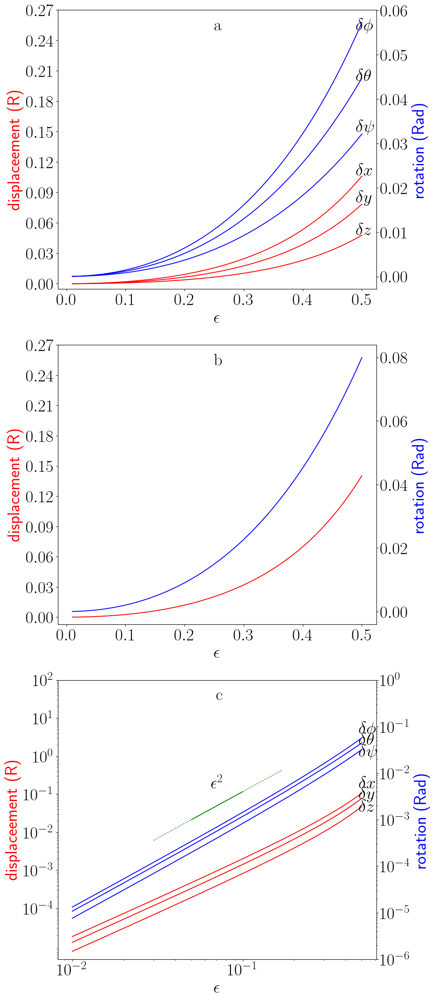
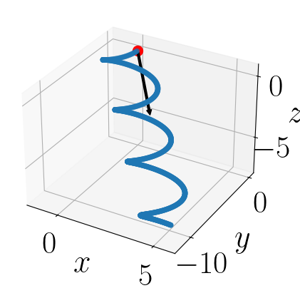
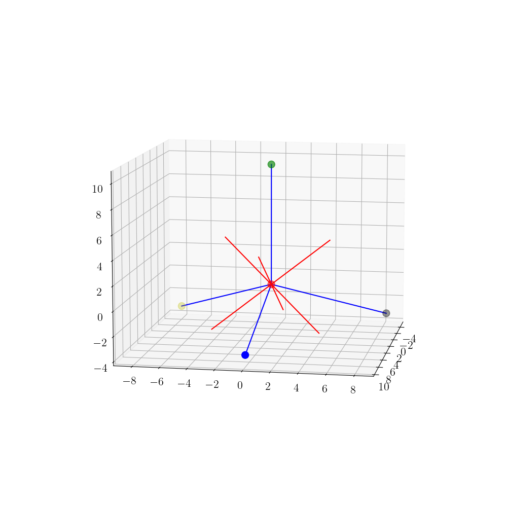
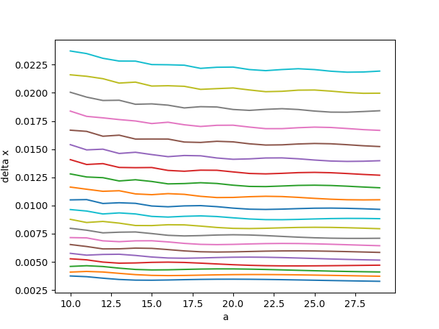

# Star Swimmer 3D

This repository contains the code and analyses for the 3D Star Swimmer Project, carried out under the supervision of Dr. Mohammadreza Ejtehadi at Sharif University of Technology. The project investigates the dynamics of microswimmers in low Reynolds number fluids via numerical simulations, using models based on the Oseen tensor and the Navier–Stokes equations.

---

## Microswimmers Dynamics in Low Reynolds Number Fluids

At low Reynolds numbers, inertia is negligible compared to viscous forces. This regime is characteristic of microswimmers, where locomotion is achieved by cyclic deformations, such as sequences of contractions and expansions. The force balance is dominated by viscous drag, requiring swimmers to execute non-reciprocal (asymmetric) motions to induce net displacements.

---

## Oseen Tensor and Navier–Stokes for Swimmers

- **Oseen Tensor**  
  The Oseen tensor describes the effect of a point force in a viscous fluid. It is used here to compute the hydrodynamic interactions between different parts of the swimmer. In [phase1.ipynb](phase1.ipynb), numerical solutions for the Oseen tensor and swimmer dynamics are presented.

- **Navier–Stokes Equations**  
  For microswimmers, the simplified version of the Navier–Stokes equations (due to low Reynolds number) is used. In this regime, the equations reduce to a balance between pressure gradients and viscous stresses, which is essential for modeling the fluid’s response to the swimmer’s motion.

---

## Repository Structure and File Descriptions

- **Root Files and Directories**  
  - `README.md`: This readme file, describing the project's background, simulation phases, and file structure.  
  - `LICENSE`: Licensing information for the project.  
  - `.gitignore`, `.vscode/`, `.idea/`: IDE and version-control settings.

- **Jupyter Notebooks**  
  - [phase1.ipynb](phase1.ipynb):  
    Implements the numerical solution of the Oseen tensor and the basic swimmer dynamics. It visualizes quantities like contraction and expansion effects.
  - [phase2.ipynb](phase2.ipynb) *(if present)*:  
    Analyzes the effect of model parameters such as joint links, bid radii, and contraction fraction.
  - [phase3.ipynb](phase3.ipynb) *(if present)*:  
    Investigates the spring-like paths generated by repeating sequences of contractions and expansions. This phase studies the sensitivity to hyperparameters and different contraction sequences.
  - [phase4.ipynb](phase4.ipynb) *(if present)*:  
    Examines the random walks and random arches resulting from perturbations in the system.
  - [phase5.ipynb](phase5.ipynb) *(if present)*:  
    Presents results related to diffusion and drift in a fluid with a prescribed concentration of enzymes.

- **Python Modules**  
  - [Swimmer.py](Swimmer.py):  
    Contains the core simulation code where the swimmer’s movement is determined by physical laws, including the generation of contraction sequences and oriented steps. Functions such as [`getAction`](Swimmer.py#L491) and [`actSequence`](Swimmer.py#L1456) implement critical parts of the dynamics.

- **Data and Figures**  
  - `data/` and `Datas/`:  
    These directories store .npy files containing simulation data and parameters.
  - `figs/`:  
    Contains output images generated by the notebooks and simulation scripts.

---

## Phases and Key Figures

- **Phase 1: Numerical Solution of Oseen Tensor and Dynamics**  
  In this phase, the numerical solution of the Oseen tensor is obtained, and the basic dynamics of the swimmer are simulated.  

- **Phase 2: Analysis of Model Parameters**  
  This phase analyzes the influence of parameters such as joint links, the radius of bids, and the contraction fraction on swimmer behavior.  
    
    
  Demonstrates how variations in the epsilon parameter can affect the swimmer’s movement.

- **Phase 3: Spring-like Paths and Contraction Sequences**  
  Here, sequences of contraction and expansion are analyzed to study their spring-like effects. The analysis examines the effects of model hyperparameters and different contraction sequences on the path of the swimmer.

   
  *vsEpsilonPlot.png* spring-like path of the swimmer as a result of repetitive motion.
   
  *vsEpsilonPlot.png* the symmetry of directinn of springlike pathes compared to the model.
 

- **Phase 4: Random Walks due to Perturbations**  
  This phase investigates the impact of perturbations that induce random walks and arching in the swimmer’s trajectory. It helps understand how external noise can affect navigation.

  
  *random_walk_p=0.125.png* Random arch of swimmer due to high probabilty of chang of sequence. 

  
  *random_walk_p=0.125.png* Random walk of swimmer due to low probabilty of chang of sequence. 

- **Phase 5: Diffusion and Drift in a Reactive Fluid**  
  In the final phase, the combined effects of diffusion and drift are examined in a fluid containing a specific concentration of enzymes, highlighting how these factors influence the overall swimmer dynamics.  

- **Model Overview**  
  The overall swimmer model and its simulation setup are represented by:  
    
  *model.png* provides a schematic overview of the swimmer, indicating key components and interactions used in the simulations.

---

## Running the Simulations

To run the simulations and view the results:

1. Open the desired notebook (e.g., [phase1.ipynb](phase1.ipynb), [swimmer3D.ipynb](swimmer3D.ipynb)) in Visual Studio Code.
2. Ensure that the necessary Python packages (such as NumPy, Matplotlib, and Numba) are installed.
3. Execute the cells sequentially to generate figures and output results.

---

## Acknowledgments

This project was performed under the supervision of Dr. Mohammadreza Ejtehadi at Sharif University of Technology. Special thanks to contributors and supporting staff for their invaluable assistance in setting up the simulation environment and analysis framework.

---

*For further inquiries or contributions, please refer to the contact information provided in the repository.*